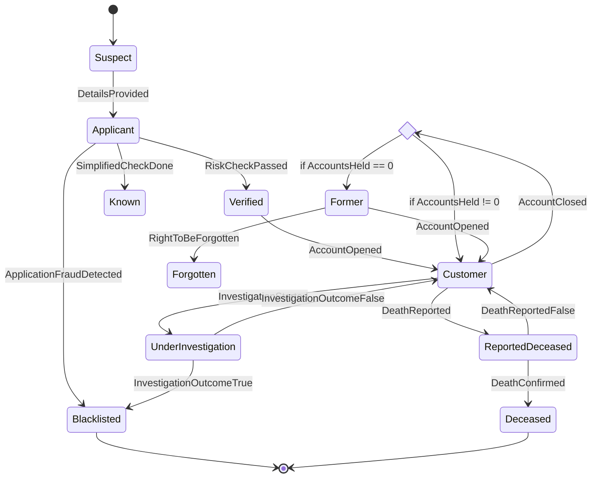

# README

State Machines may seem simple at first, but they can quickly evolve into complex, hard-to-understand logic that becomes difficult to visualize and maintain.

The purpose of this project is twofold:

1. To design and implement a simple, reusable state machine that is easy to integrate into existing projects while being flexible enough to accommodate a variety of use cases.
2. To explore the concept of "Documentation as Code." Specifically : Using source code generation, the code can be automatically updated to reflect changes in the documentation. Moreover analysis tools can be used to ensure that the state machine is valid and complete.

---

## 1. State Machine Implementation

A State Machine consists of the following components:
- **A subject**: The entity whose state is being managed.
- **A set of states**: The possible states the subject can be in.
- **A set of events**: The actions or inputs that can be applied to the subject.
- **A set of transitions**: Rules that determine how states change in response to events. These transitions specify:
  - Which states an event can be applied to.
  - The resulting state after the event is applied.
  - Any conditions that must be met for the transition to occur.

When an event is applied to a subject, the following can happen:
1. The subject transitions to a new state based on the defined rules.
2. The event is rejected as invalid, and the subject's state remains unchanged.

---

### Example: State Diagram

Consider the following state diagram:

When a `DetailsProvided` event is applied to a subject in the Suspect state, the subject transitions to the Applicant state.
However, However, if the DetailsProvided event is applied to a subject in the Blacklisted state, it will be rejected as invalid.

Transitions can also contain conditions that must be matched to be valid. For example, the transition from Customer when the AccountClosed event is applied has two possible outcomes based on the number of accounts the customer has.

---
## 2. Concept: Documentation as Code

The documentation for this project is written in Markdown and stored in the project's source code repository. This approach has several benefits:

1. Version Control
Documentation is versioned alongside the code, ensuring that changes to the documentation are tracked, just like code changes.
You can view the history of changes, compare versions, and revert to previous versions if needed.

2. Synchronization with Code
Documentation and code are stored together, making it easier to ensure they stay in sync.
Using source code generation, the code can be automatically updated to reflect changes in the documentation.
Moreover analysis tools can be used to ensure that the state machine is valid and complete.

3. Accessibility
Markdown files are lightweight, human-readable, and easy to edit with any text editor or integrated development environment (IDE).
They can be browsed and viewed directly within most repository management platforms (e.g., GitHub, GitLab, Bitbucket).

4. Collaboration
Developers can collaborate on documentation using the same workflows they use for code (e.g., pull requests, code reviews, and comments).
Team members can propose edits, request feedback, and ensure the documentation meets the project's standards.

6. Ease of Maintenance
Because the documentation lives alongside the code, there's no need to maintain a separate documentation repository or system.
Developers are more likely to keep the documentation up-to-date when it's part of the same workflow as coding.
