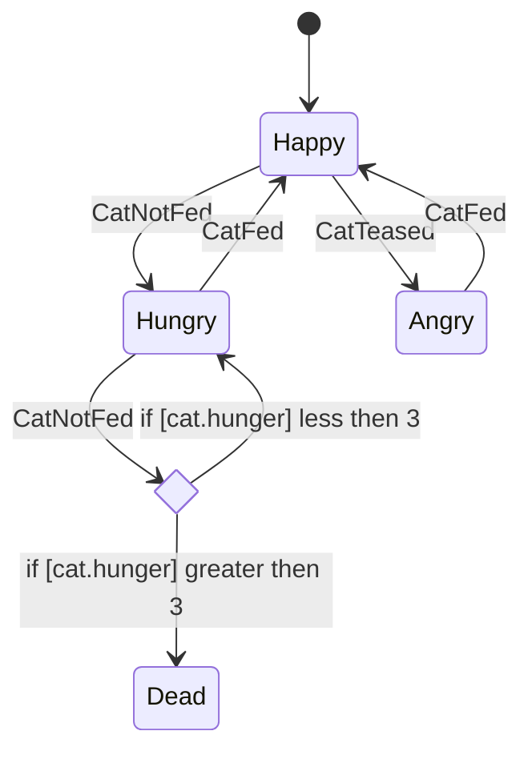

```mermaid 
stateDiagram-v2


[*] --> Happy

state CatNotFed_choices <<choice>>
state Hungry	
state Angry	
state Happy	
state Angry	

 Happy --> Hungry: CatNotFed
 Happy --> Angry: CatTeased
 Hungry --> Happy: CatFed
 Hungry --> CatNotFed_choices: CatNotFed
	CatNotFed_choices --> Dead: if [cat.hunger] greater then 3
	CatNotFed_choices --> Hungry: if [cat.hunger] less then 3
Angry --> Happy: CatFed


```