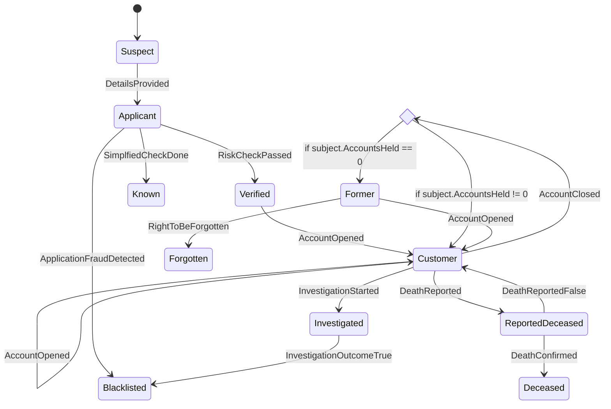

```mermaid 
stateDiagram-v2

state when_AccountClosed <<choice>>


[*] --> Suspect
	Suspect --> Applicant: DetailsProvided
	Applicant --> Verified: RiskCheckPassed
	Applicant --> Known: SimplfiedCheckDone
	Applicant --> Blacklisted: ApplicationFraudDetected
	Verified --> Customer: AccountOpened
	Customer --> Customer: AccountOpened
	Customer	--> when_AccountClosed:	AccountClosed
	when_AccountClosed --> Former:		if subject.AccountsHeld == 0
	when_AccountClosed --> Customer:	if subject.AccountsHeld != 0
	Customer --> Investigated: InvestigationStarted
	Customer --> ReportedDeceased: DeathReported
	ReportedDeceased --> Deceased: DeathConfirmed
	ReportedDeceased --> Customer: DeathReportedFalse
	Former --> Customer: AccountOpened
	Former --> Forgotten: RightToBeForgotten
	Investigated --> Blacklisted: InvestigationOutcomeTrue
```