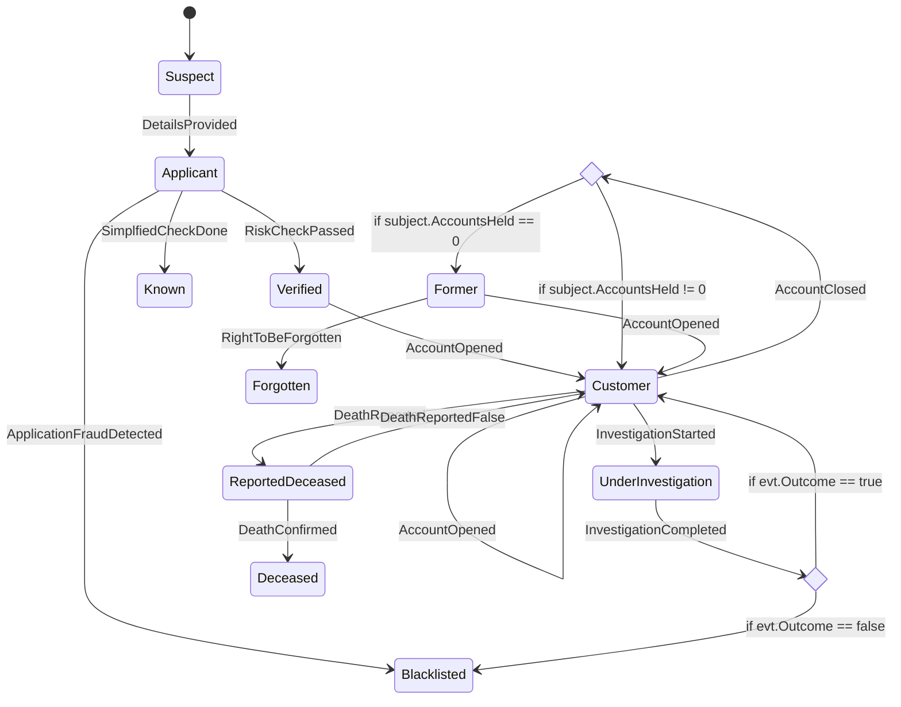

```mermaid 
stateDiagram-v2

state AccountClosed_choices <<choice>>
state InvestigationCompleted_choices <<choice>>

[*] --> Suspect
 Suspect --> Applicant: DetailsProvided
 Applicant --> Verified: RiskCheckPassed
 Applicant --> Known: SimplfiedCheckDone
 Applicant --> Blacklisted: ApplicationFraudDetected
 Verified --> Customer: AccountOpened
 Customer --> Customer: AccountOpened
 Customer --> AccountClosed_choices: AccountClosed
  AccountClosed_choices --> Former:  if subject.AccountsHeld == 0
  AccountClosed_choices --> Customer: if subject.AccountsHeld != 0
 Customer --> UnderInvestigation: InvestigationStarted
 UnderInvestigation --> InvestigationCompleted_choices: InvestigationCompleted
  InvestigationCompleted_choices --> Customer: if evt.Outcome == true
  InvestigationCompleted_choices --> Blacklisted: if evt.Outcome == false
 Customer --> ReportedDeceased: DeathReported
 ReportedDeceased --> Deceased: DeathConfirmed
 ReportedDeceased --> Customer: DeathReportedFalse
 Former --> Customer: AccountOpened
 Former --> Forgotten: RightToBeForgotten
```