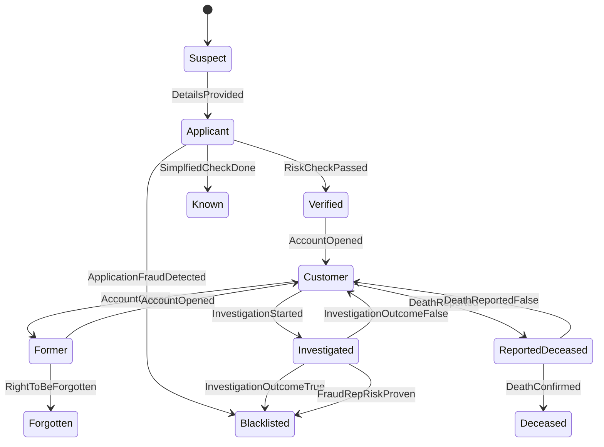

# Schema

```json
{
  "Name": "ExampleProject",
  "Events": [
    {
      "Name": "AccountAssociation",
      "Properties": []
    },
    {
      "Name": "DetailsProvided",
      "Properties": []
    },
    {
      "Name": "RiskCheckPassed",
      "Properties": []
    },
    {
      "Name": "RiskCheckExpired",
      "Properties": []
    },
    {
      "Name": "AccountOpened",
      "Properties": []
    },
    {
      "Name": "AccountClosed",
      "Properties": []
    },
    {
      "Name": "RightToBeForgotten",
      "Properties": []
    },
    {
      "Name": "ApplicationFraudDetected",
      "Properties": []
    },
    {
      "Name": "SimplfiedCheckDone",
      "Properties": []
    },
    {
      "Name": "InvestigationStarted",
      "Properties": []
    },
    {
      "Name": "InvestigationOutcomeTrue",
      "Properties": []
    },
    {
      "Name": "InvestigationOutcomeFalse",
      "Properties": []
    },
    {
      "Name": "RelationshipClosed",
      "Properties": []
    },
    {
      "Name": "FullCheckDone",
      "Properties": []
    },
    {
      "Name": "DeathReported",
      "Properties": []
    },
    {
      "Name": "DeathConfirmed",
      "Properties": []
    },
     {
      "Name": "DeathReportedFalse",
      "Properties": []
    },
    {
      "Name": "FraudRepRiskProven",
      "Properties": []
    },
    {
      "Name": "AccountStatusUpdate",
      "Properties": [
        {
          "Name": "Status",
          "Type": {
            "Name": "ExampleProject.Events.AccountStatus",
            "Values": [
              "Open",
              "Closed"
            ]
          }
        }
      ]
    },
    {
      "Name": "LifeEventUpdate",
      "Properties": [
        {
          "Name": "Status",
          "Type": {
            "Name": "ExampleProject.Events.LifeEventStatus",
            "Values": [
              "Alive",
              "Dead",
              "Pending"
            ]
          }
        }
      ]
    }
  ],
  "Entities": [
    {
      "Name": "CustomerView",
      "StateTypeName": "ExampleProject.Models.CustomerState",
      "States": [
        "Suspect",
        "Applicant",
        "Known",
        "Former",
        "Forgotten",
        "Investigated",
        "Blacklisted",
        "Archived",
        "Verified",
        "Customer",
        "ReportedDeceased",
        "Deceased"
      ]
    }
  ]
}
```